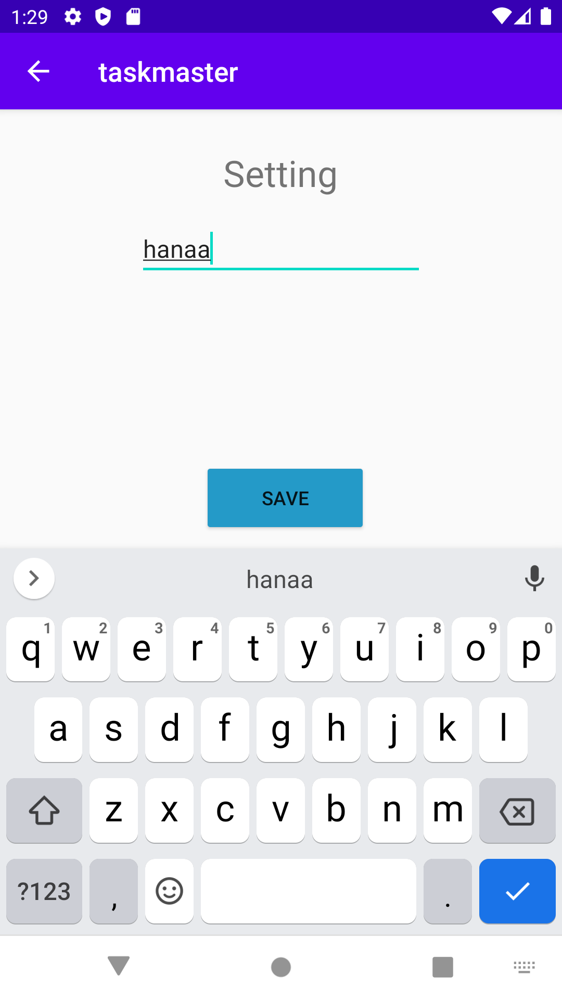
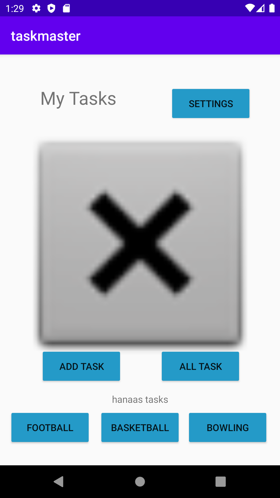

# taskmaster
used to render tasks and help you to remember it

Set up the settings page using shared preferences to save the username and apply it to the settings page and the home page.

Set up the Task Detail page, and created three buttons on the home page all of which take the user to the taskItem detail page.

Each of the buttons displays a different taskItem title, and displays that title on the taskItem detail page when clicked.

